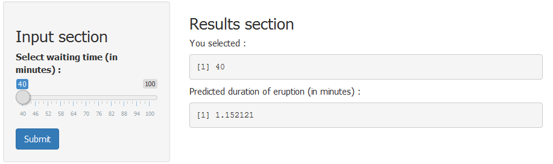

## What the app does

1. Uses 'geyser' R dataset(eruptions data from the 'Old Faithful' geyser in Yellowstone National Park) to build a linear model on eruption duration.
2. Predicts the eruption duration given the waiting time between eruptions.
3. Presents predicted values of eruption and the prediction interval for the waiting time of entire dataset.

<div style='text-align: center;'>
    
</div>


---  

## Understanding the linear model 

Behind the scenes, the app uses linear model to predict the eruption time.


```r
        library(caret); data(faithful)
        geyserdata <- as.data.frame(faithful)
        set.seed(975); inTrain = createDataPartition(geyserdata$eruptions, p = 0.80)[[1]]
        trainsub = geyserdata[ inTrain,]; testsub = geyserdata[-inTrain,]
        set.seed(978); modelfit <- lm(eruptions ~ waiting, data = trainsub)
```

Since it is a small dataset, 80% of the data is used to train and 20% was used to test the model. Below graph shows the predicted duration values for test subset with linear model(Red line) and prediction interval(Green lines) 


---

## Summary of the model


```
## 
## Call:
## lm(formula = eruptions ~ waiting, data = trainsub)
## 
## Residuals:
##      Min       1Q   Median       3Q      Max 
## -1.30318 -0.37966  0.03319  0.33511  1.18779 
## 
## Coefficients:
##              Estimate Std. Error t value Pr(>|t|)    
## (Intercept) -1.877981   0.170018  -11.05   <2e-16 ***
## waiting      0.075753   0.002363   32.06   <2e-16 ***
## ---
## Signif. codes:  0 '***' 0.001 '**' 0.01 '*' 0.05 '.' 0.1 ' ' 1
## 
## Residual standard error: 0.4808 on 218 degrees of freedom
## Multiple R-squared:  0.825,	Adjusted R-squared:  0.8242 
## F-statistic:  1028 on 1 and 218 DF,  p-value: < 2.2e-16
```


---

## Why use it

1. Simple and easy - Use a simple slider to enter waiting time and predict eruption time
2. General understanding of the geyser data from the 'prediction interval' plot
3. Reusable - Can be used as a base for other datasets to find linear relationships
4. Scalable - More observations can be added to the underlying linear model without affecting the user interface.
5. Reproducible - R coding helps make it reproducible (Eg. Setting seed before building the model)
